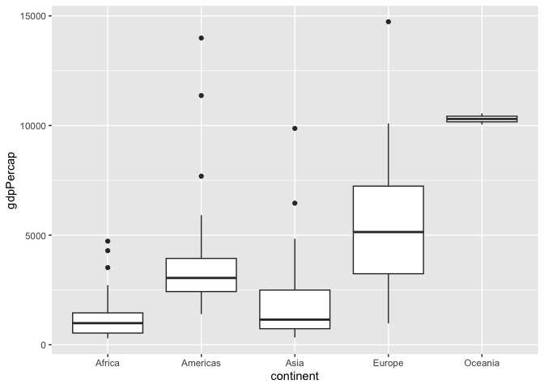
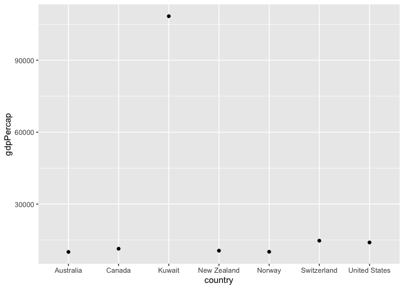
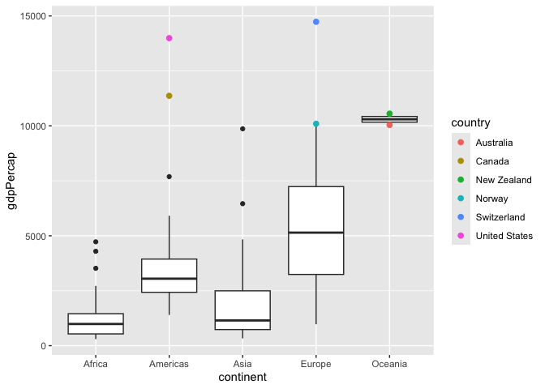
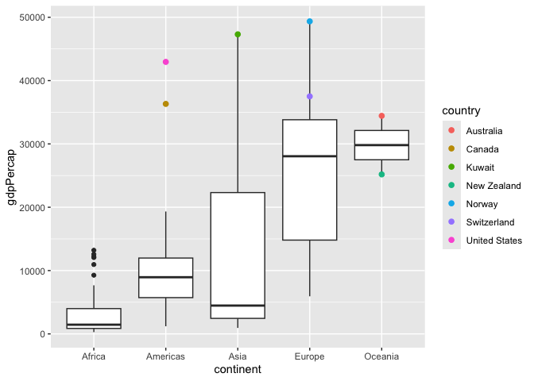
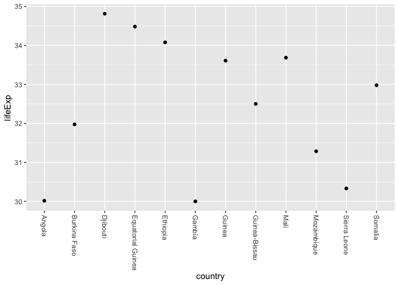
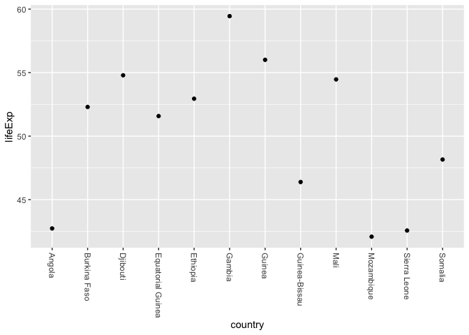
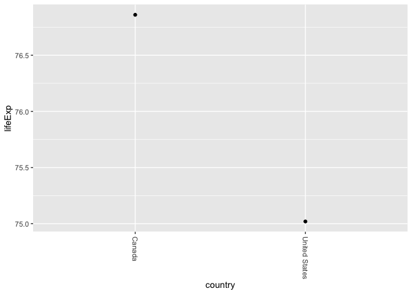
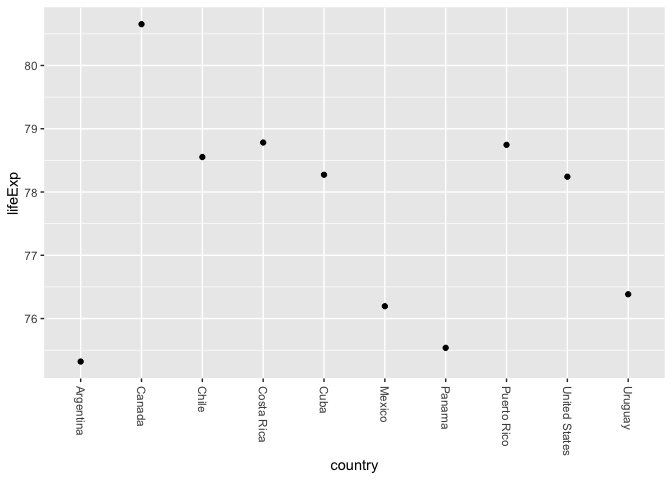
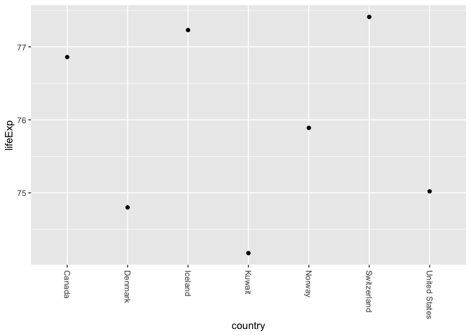
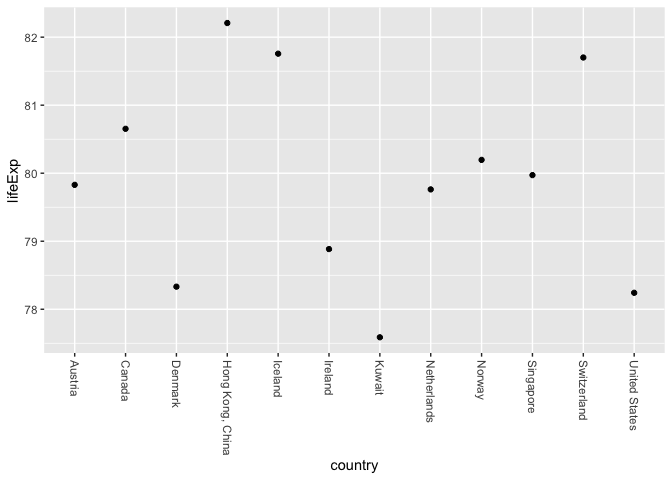

Gapminder
================
Isbella Batalla
Sept. 28, 2026

- [Grading Rubric](#grading-rubric)
  - [Individual](#individual)
  - [Submission](#submission)
- [Guided EDA](#guided-eda)
  - [**q0** Perform your “first checks” on the dataset. What variables
    are in
    this](#q0-perform-your-first-checks-on-the-dataset-what-variables-are-in-this)
  - [**q1** Determine the most and least recent years in the `gapminder`
    dataset.](#q1-determine-the-most-and-least-recent-years-in-the-gapminder-dataset)
  - [**q2** Filter on years matching `year_min`, and make a plot of the
    GDP per capita against continent. Choose an appropriate `geom_` to
    visualize the data. What observations can you
    make?](#q2-filter-on-years-matching-year_min-and-make-a-plot-of-the-gdp-per-capita-against-continent-choose-an-appropriate-geom_-to-visualize-the-data-what-observations-can-you-make)
  - [**q3** You should have found *at least* three outliers in q2 (but
    possibly many more!). Identify those outliers (figure out which
    countries they
    are).](#q3-you-should-have-found-at-least-three-outliers-in-q2-but-possibly-many-more-identify-those-outliers-figure-out-which-countries-they-are)
  - [**q4** Create a plot similar to yours from q2 studying both
    `year_min` and `year_max`. Find a way to highlight the outliers from
    q3 on your plot *in a way that lets you identify which country is
    which*. Compare the patterns between `year_min` and
    `year_max`.](#q4-create-a-plot-similar-to-yours-from-q2-studying-both-year_min-and-year_max-find-a-way-to-highlight-the-outliers-from-q3-on-your-plot-in-a-way-that-lets-you-identify-which-country-is-which-compare-the-patterns-between-year_min-and-year_max)
- [Your Own EDA](#your-own-eda)
  - [**q5** Create *at least* three new figures below. With each figure,
    try to pose new questions about the
    data.](#q5-create-at-least-three-new-figures-below-with-each-figure-try-to-pose-new-questions-about-the-data)

*Purpose*: Learning to do EDA well takes practice! In this challenge
you’ll further practice EDA by first completing a guided exploration,
then by conducting your own investigation. This challenge will also give
you a chance to use the wide variety of visual tools we’ve been
learning.

<!-- include-rubric -->

# Grading Rubric

<!-- -------------------------------------------------- -->

Unlike exercises, **challenges will be graded**. The following rubrics
define how you will be graded, both on an individual and team basis.

## Individual

<!-- ------------------------- -->

| Category | Needs Improvement | Satisfactory |
|----|----|----|
| Effort | Some task **q**’s left unattempted | All task **q**’s attempted |
| Observed | Did not document observations, or observations incorrect | Documented correct observations based on analysis |
| Supported | Some observations not clearly supported by analysis | All observations clearly supported by analysis (table, graph, etc.) |
| Assessed | Observations include claims not supported by the data, or reflect a level of certainty not warranted by the data | Observations are appropriately qualified by the quality & relevance of the data and (in)conclusiveness of the support |
| Specified | Uses the phrase “more data are necessary” without clarification | Any statement that “more data are necessary” specifies which *specific* data are needed to answer what *specific* question |
| Code Styled | Violations of the [style guide](https://style.tidyverse.org/) hinder readability | Code sufficiently close to the [style guide](https://style.tidyverse.org/) |

## Submission

<!-- ------------------------- -->

Make sure to commit both the challenge report (`report.md` file) and
supporting files (`report_files/` folder) when you are done! Then submit
a link to Canvas. **Your Challenge submission is not complete without
all files uploaded to GitHub.**

``` r
library(tidyverse)
```

    ## ── Attaching core tidyverse packages ──────────────────────── tidyverse 2.0.0 ──
    ## ✔ dplyr     1.2.0     ✔ readr     2.2.0
    ## ✔ forcats   1.0.1     ✔ stringr   1.6.0
    ## ✔ ggplot2   4.0.2     ✔ tibble    3.3.1
    ## ✔ lubridate 1.9.5     ✔ tidyr     1.3.2
    ## ✔ purrr     1.2.1     
    ## ── Conflicts ────────────────────────────────────────── tidyverse_conflicts() ──
    ## ✖ dplyr::filter() masks stats::filter()
    ## ✖ dplyr::lag()    masks stats::lag()
    ## ℹ Use the conflicted package (<http://conflicted.r-lib.org/>) to force all conflicts to become errors

``` r
library(gapminder)
```

*Background*: [Gapminder](https://www.gapminder.org/about-gapminder/) is
an independent organization that seeks to educate people about the state
of the world. They seek to counteract the worldview constructed by a
hype-driven media cycle, and promote a “fact-based worldview” by
focusing on data. The dataset we’ll study in this challenge is from
Gapminder.

# Guided EDA

<!-- -------------------------------------------------- -->

First, we’ll go through a round of *guided EDA*. Try to pay attention to
the high-level process we’re going through—after this guided round
you’ll be responsible for doing another cycle of EDA on your own!

### **q0** Perform your “first checks” on the dataset. What variables are in this

dataset?

``` r
## TASK: Do your "first checks" here!
glimpse(gapminder)
```

    ## Rows: 1,704
    ## Columns: 6
    ## $ country   <fct> "Afghanistan", "Afghanistan", "Afghanistan", "Afghanistan", …
    ## $ continent <fct> Asia, Asia, Asia, Asia, Asia, Asia, Asia, Asia, Asia, Asia, …
    ## $ year      <int> 1952, 1957, 1962, 1967, 1972, 1977, 1982, 1987, 1992, 1997, …
    ## $ lifeExp   <dbl> 28.801, 30.332, 31.997, 34.020, 36.088, 38.438, 39.854, 40.8…
    ## $ pop       <int> 8425333, 9240934, 10267083, 11537966, 13079460, 14880372, 12…
    ## $ gdpPercap <dbl> 779.4453, 820.8530, 853.1007, 836.1971, 739.9811, 786.1134, …

**Observations**:

- Write all variable names here

Country, Continent, Year, Life Expectancy, Population, and GDP Per
Capita

### **q1** Determine the most and least recent years in the `gapminder` dataset.

*Hint*: Use the `pull()` function to get a vector out of a tibble.
(Rather than the `$` notation of base R.)

``` r
## TASK: Find the largest and smallest values of `year` in `gapminder`
year_max <- gapminder %>% 
            pull(year) %>%
            max()
            
year_min <- gapminder %>% 
            pull(year) %>%
            min()
```

Use the following test to check your work.

``` r
## NOTE: No need to change this
assertthat::assert_that(year_max %% 7 == 5)
```

    ## [1] TRUE

``` r
assertthat::assert_that(year_max %% 3 == 0)
```

    ## [1] TRUE

``` r
assertthat::assert_that(year_min %% 7 == 6)
```

    ## [1] TRUE

``` r
assertthat::assert_that(year_min %% 3 == 2)
```

    ## [1] TRUE

``` r
if (is_tibble(year_max)) {
  print("year_max is a tibble; try using `pull()` to get a vector")
  assertthat::assert_that(False)
}

print("Nice!")
```

    ## [1] "Nice!"

### **q2** Filter on years matching `year_min`, and make a plot of the GDP per capita against continent. Choose an appropriate `geom_` to visualize the data. What observations can you make?

You may encounter difficulties in visualizing these data; if so document
your challenges and attempt to produce the most informative visual you
can.

``` r
## TASK: Create a visual of gdpPercap vs continent
gapminder %>%
  filter(
    year == year_min,
    gdpPercap < 30000
  ) %>%
  ggplot(aes(x = continent, y = gdpPercap)) +
   geom_boxplot()
```

<!-- -->

**Observations**:

The continent with the lowest median GDP per capita is Africa, while the
continent with the highest median is Europe. Oceania has a much smaller
boxplot, probably becasue it has fewer countries. There was one
significant outlier, that had to be “cut out”, this country was in the
continent of Asia. **Difficulties & Approaches**:

- Write your challenges and your approach to solving them

The challenge with plotting the original data was that there was an
outlier that made the box plots look very small, too small to be able to
read them. One approach to solving this could be to filter out the
outlier, and when presenting, make a note of the changes that were made
to the data. This ensures that the viewer has a full understanding of
the visual and it’s alterations to the data.

### **q3** You should have found *at least* three outliers in q2 (but possibly many more!). Identify those outliers (figure out which countries they are).

``` r
## TASK: Identify the outliers from q2
gapminder %>%
  filter(
    year == year_min,
    gdpPercap > 10000
  ) %>%
   ggplot(aes(x = country, y = gdpPercap)) +
   geom_point()
```

<!-- -->

**Observations**:

- Identify the outlier countries from q2 The most prominent outlier is
  Kuwait. After Kuwait is Switzerland and the United States.

*Hint*: For the next task, it’s helpful to know a ggplot trick we’ll
learn in an upcoming exercise: You can use the `data` argument inside
any `geom_*` to modify the data that will be plotted *by that geom
only*. For instance, you can use this trick to filter a set of points to
label:

``` r
## NOTE: No need to edit, use ideas from this in q4 below
gapminder %>%
  filter(year == max(year)) %>%

  ggplot(aes(continent, lifeExp)) +
  geom_boxplot() +
  geom_point(
    data = . %>% filter(country %in% c("United Kingdom", "Japan", "Zambia")),
    mapping = aes(color = country),
    size = 2
  )
```

<!-- -->

### **q4** Create a plot similar to yours from q2 studying both `year_min` and `year_max`. Find a way to highlight the outliers from q3 on your plot *in a way that lets you identify which country is which*. Compare the patterns between `year_min` and `year_max`.

*Hint*: We’ve learned a lot of different ways to show multiple
variables; think about using different aesthetics or facets.

``` r
## TASK: Create a visual of gdpPercap vs continent
gapminder %>%
  filter(
    year == year_min,
    gdpPercap < 30000
  ) %>%
  ggplot(aes(x = continent, y = gdpPercap)) +
  geom_boxplot() +
  geom_point(
    data = . %>% filter(
    year == year_min,
    gdpPercap > 10000
  ),
    mapping = aes(color = country),
    size = 2
  )
```

<!-- -->

``` r
gapminder %>%
  filter(
    year == year_max
  ) %>%
  ggplot(aes(x = continent, y = gdpPercap)) +
  geom_boxplot() +
  geom_point(
    data = . %>% filter(country %in% c("Australia", "Canada", "New Zealand", "Norway", "Switzerland", "United States", "Kuwait")),
    mapping = aes(color = country),
    size = 2
  )
```

<!-- -->

**Observations**: After plotting the data, only highlighting the
outliers from Q3, we are able to see some patterns and changes. Both
Canada and the United States remain significant ouliers in the Americas
boxplot. Although not all are outliers, most of the ouliers in the
Americas, Asia, and Europe maintain a higher GDP per capita. The
countries that dont’, however, are Switzerland and New Zeland. New
Zeland is seen to actually drop below Australia in GDP. Switzerland is
seen to drop in standing (not actual GDP) from being a noticable outlier
to being a country within the 3rd quartile.

One things to note: Most, if not all, countries saw and increase in GDP
per capita.

# Your Own EDA

<!-- -------------------------------------------------- -->

Now it’s your turn! We just went through guided EDA considering the GDP
per capita at two time points. You can continue looking at outliers,
consider different years, repeat the exercise with `lifeExp`, consider
the relationship between variables, or something else entirely.

### **q5** Create *at least* three new figures below. With each figure, try to pose new questions about the data.

``` r
## TASK: Your first graph
Africa_LifeExp_Under35 <- gapminder  %>%
    filter(
    year == year_min,
    continent == "Africa",
    lifeExp < 35
  )

countries_in_data = Africa_LifeExp_Under35 %>% 
  pull(country)


Africa_LifeExp_Under35%>%
  ggplot(aes(x = country, y = lifeExp)) +
   geom_point() +
  theme(axis.text.x = element_text(angle = 270, vjust = 0.5, hjust = 0))
```

<!-- -->

``` r
gapminder %>%
  filter(
    year == year_max,
    country %in% countries_in_data
  ) %>%
  ggplot(aes(x = country, y = lifeExp)) +
   geom_point() +
  theme(axis.text.x = element_text(angle = 270, vjust = 0.5, hjust = 0))
```

<!-- -->

- For these graphs, I wanted to see how life expectancy changed in
  Africa with countries that had a life expectancy under 35 for the year
  of 1952, and how that changed compared to the most recent data form
  2007. 

After plotting, it can be seen how all the countries, all 12 of them, no
longer have a life expectancy under 35. Instead, the life expectancy has
risen, especially in Gambia which had one of the lowest life
expectancies at around 30, to one of the highest among the group at just
below 60.

Questions about the data:

\- What explains the difference between the big improvers (Gambia,
Guinea) and the countries that improved less (Mozambique, Sierra Leone,
Angola)? - Are the countries that improved least also the ones with the
lowest GDP per capita growth?

``` r
## TASK: Your second graph
gapminder %>%
  filter(
    year == 1987,
    continent == "Americas",
    lifeExp > 75
  ) %>%
  ggplot(aes(x = country, y = lifeExp)) +
   geom_point() +
  theme(axis.text.x = element_text(angle = 270, vjust = 0.5, hjust = 0))
```

<!-- -->

``` r
gapminder %>%
  filter(
    year == year_max,
    continent == "Americas",
    lifeExp > 75
  ) %>%
  ggplot(aes(x = country, y = lifeExp)) +
   geom_point() +
  theme(axis.text.x = element_text(angle = 270, vjust = 0.5, hjust = 0))
```

<!-- -->

- For these graphs I wanted to see which countries in the Americas had a
  life expectancy over 75 in 1987 compared to 2007. In 1987, only two
  countries in the Americas were above 75: Canada (about 76.9) and the
  United States (just barely, about 75.0). By year_max, ten countries
  were above 75.

Canada is the highest in both years, and its lead grew, from about 76.9
to about 80.7.

Questions about the data:

\- Why did Canada’s life expectancy pull ahead of the US’s over this
period?

``` r
## TASK: Your third graph
gapminder %>%
  filter(
    year == 1987,
    lifeExp > 60,
    gdpPercap > 25000
  ) %>%
  ggplot(aes(x = country, y = lifeExp)) +
   geom_point() +
  theme(axis.text.x = element_text(angle = 270, vjust = 0.5, hjust = 0))
```

<!-- -->

``` r
gapminder %>%
  filter(
    year == year_max,
    lifeExp > 60,
    gdpPercap > 35000
  ) %>%
  ggplot(aes(x = country, y = lifeExp)) +
   geom_point() +
  theme(axis.text.x = element_text(angle = 270, vjust = 0.5, hjust = 0))
```

<!-- -->

- For these graphs, I wanted to see which countries had a GDP per capita
  above \$25,000 and a life expectancy above 60 in 1987? By year_max,
  which countries were above \$35,000 and above 60, and did higher
  income translate into higher life expectancy

In 1987, seven countries cleared the income threshold. By year_max,
twelve countries cleared the higher threshold.

- Hong Kong (about 82.2), Iceland (about 81.8), and Switzerland (about
  81.7) are the top three. Hong Kong and Singapore are new to the group
  and have very high life expectancy.
- Kuwait and the United States remain among the lowest of the
  high-income group in both years (about 77.6 and 78.2 in the latest
  year), so their high income does not translate into the highest life
  expectancy.

Questions about the data:

\- Why do some very wealthy countries (Kuwait, the United States) have
lower life expectancy than less wealthy ones?
